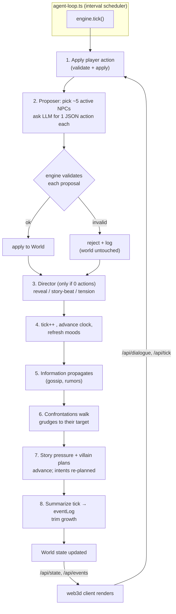

# How Aliveville works end-to-end

A learning-tier tour of what actually runs when you play Aliveville, grounded
in the current `src/` code rather than the vision. It answers three questions:
what the moving parts are, how one turn of the world flows through them, and
*why* the load-bearing decisions (local models, engine-validated actions,
fandom ingest) were made.

For the layer map and invariants see
[`overview.md`](./overview.md); this page is the runtime *story* that stitches
those layers together. Deep dives live in
[`llm-routing.md`](./llm-routing.md) and [`web3d-client.md`](./web3d-client.md).

## The one-sentence version

A deterministic TypeScript engine advances a `World` on a fixed interval; on
each tick a handful of NPC "brains" ask an LLM (local by default) for one JSON
action each, the **engine validates and applies** those actions, information
and grudges propagate on their own, and a **director** injects pressure when the
world goes quiet — all rendered by a separate 3D client that only reads state.

## The moving parts (all implemented)

| Component | File | Role |
|---|---|---|
| Engine / tick loop | `src/simulation.ts` (`runTick`) | Owns `World` state, applies + validates every action, advances clock/economy/combat. |
| Agent loop driver | `src/agent-loop.ts` (`createAgentLoop`) | Fixed-interval scheduler (default 4 s) that calls `engine.tick()`, checkpoints, restores. |
| Agent brains | `src/agents.ts`, `src/llm/proposer.ts` | Deterministic intent/mood/schedule planning + the per-tick LLM proposal firehose. |
| Director | `src/director.ts` | Reveals clues, injects story beats, escalates the highest inter-NPC tension. |
| Dialogue | `src/dialogue.ts` | Player↔NPC turns: memory recall → LLM reply → coherence check → engine-validated actions. |
| LLM router | `src/llm/router.ts` | One OpenAI-compatible/CLI abstraction across `background`/`normal`/`quest` tiers, with a rate-limit governor. |
| Memory + reflection | `src/agents.ts`, `src/memory-score.ts`, `src/reflection.ts`, `src/llm/embeddings.ts` | Importance-scored memories, cosine-similarity recall, periodic LLM reflection into beliefs. |
| Fandom / world ingest | `src/fandom-import.ts` → `src/world-ingest.ts` → `src/anime-ingest.ts` | Turn a franchise name (or authored source) into a validated `World`. |
| Server / Worker edge | `src/server.ts`, `worker/` | `/api/*` routes; one `GameSessionDO` per visitor in production. |
| 3D client | `web3d/` | Reads `World` over `/api/*`, generates the town deterministically, renders + drives movement imperatively. |

The LLM never touches the world directly — it only *proposes* JSON, and every
proposal is re-validated against live state. This is the project's central
invariant (see
[`adr-008`](./decisions/adr-008-engine-validated-json-actions.md)).

## One tick, start to finish

`createAgentLoop` fires `engine.tick()` on an interval (min 250 ms, default
4 s; `src/agent-loop.ts:51`), checkpointing every 5 ticks so a session can be
rewound. Each tick runs `runTick` (`src/simulation.ts:187`) in this order:

The important shape: the LLM appears only in step 2 (and inside the director in
step 3), and everything downstream — propagation, confrontations, pressure — is
deterministic engine code that keeps the world "scheming on its own" even with
no model configured.

### Who gets a brain each tick

The proposer (`src/llm/proposer.ts`) does **not** run every NPC through the LLM.
It picks the active NPCs and slices to `maxNpcs` (5 by default) so call volume
stays bounded, builds a per-NPC system prompt from that character's traits,
mood, intent, schedule, and recalled memories, and asks for exactly one action.
Anything the LLM returns is re-checked by `validateAction`; on failure it is
logged and dropped, never applied. When no LLM is enabled, the proposer returns
nothing and the deterministic layers alone carry the tick.

### The deterministic backbone (no LLM required)

Even model-free, a tick still *moves*:

- **Intents, moods, schedules** — `planAgentIntent` in `src/agents.ts` derives
  an intent (`escalate`, `investigate`, `hide`, `confront`, `help`, `wait`, …)
  from needs, secrets, suspicion, and villain plans; `refreshMoods` drifts
  stress/suspicion by time of day and director pressure.
- **Information travels** — `propagateInformation` (`src/rumors.ts`) spreads
  gossip between co-located NPCs, changing relationships without any player input.
- **Grudges move bodies** — `executeConfrontations` walks NPCs with a
  confrontation goal toward their target.
- **Pressure builds when quiet** — `advanceStoryPressure` (`src/agents.ts:105`)
  raises director pressure faster on quiet ticks (+8 vs +2) and advances hidden
  villain plans harder after dusk, so a still world tightens rather than stalls.

### The director's job

When a tick produces zero actions (`runTick` only calls it then), the director
(`src/director.ts`) picks one nudge: emit a pending clue reveal, drop a story
beat once pressure ≥ 40, or find the worst inter-NPC relationship
(`findHighestTension`) and either ask the LLM (`quest` tier) for an in-character
event or fall back to a scripted gossip/remember. It is the world's "keep things
interesting" valve, not a scripted plot.

## Memory: how NPCs stay in character

Memories are importance-scored deterministically at write time —
`memoryMetaFromText` (`src/agents.ts:303`) scores high-stakes lore, conflict,
and consequence on a ~1–9 scale (a lightweight, LLM-free take on the mem0 idea).
Recall is hybrid: `retrieveMemoriesSemantic` embeds the query and each memory
via the same OpenAI-compatible gateway (`src/llm/embeddings.ts`) and ranks by
cosine similarity, **falling back to keyword scoring** (`src/memory-score.ts`)
whenever embeddings are unavailable — zero regression with no embedding backend.
Periodically, `src/reflection.ts` sums recent memory importance and, past a
threshold (24, tuned down from the Generative Agents paper's dense-stream 150),
asks the LLM to distil recent memories into one belief that later dialogue reads
back. This is the Generative Agents / AI Town lineage, adapted to a sparse
event stream.

## Dialogue turn

When the player talks (`POST /api/dialogue`, `src/dialogue.ts`), the turn is:
recall relevant + reflection memories → build a character system prompt →
stream an LLM reply → run a **coherence check** that can retry once with a
correction hint → parse any embedded JSON actions and run each through
`validateAction`. Same invariant as the tick: dialogue can *propose* moves,
gifts, or quest steps, but only validated ones mutate the world.

## Turning a fandom into a world

The ingest pipeline (`src/fandom-import.ts`) is the moat mechanism — "type a
franchise, get a playable world":

1. **Plan** — an LLM picks the likely `*.fandom.com` subdomain and a playable
   slice (cast, antagonist, locations) as strict JSON.
2. **Ground** — MediaWiki TextExtracts fetches real intro text for each entity
   (capped per entity), so characters are grounded in canon, not hallucinated.
3. **Compile** — an LLM turns those extracts into a `WorldIngestSource`, which
   `validateWorldIngestSource` (`src/world-ingest.ts`) checks before
   `worldSourceToWorld`/`animeSourceToWorld` materializes a full `World` (NPCs
   with traits, needs, schedules, factions, conflicts, artifacts).

Authored sources skip step 1–2 and enter at `import-world-source`. The output
is an ordinary `World`, so the entire runtime above works on ingested worlds
unchanged.

## Why these decisions

- **Local models by default.** `isLlmEnabled` accepts a local server
  (Ollama/LM Studio via `LLM_BASE_URL`) or a coding-agent CLI with no API key
  (`src/llm/router.ts:32`). The whole game is playable at zero marginal cost,
  which matters when *every NPC every few seconds* wants a completion; the
  router's ambient rate-limit governor exists precisely because the proposal
  firehose can otherwise starve player dialogue. See
  [`llm-routing.md`](./llm-routing.md) and
  [`adr-006`](./decisions/adr-006-openai-compatible-router.md) /
  [`adr-007`](./decisions/adr-007-tiered-model-selection.md).
- **Engine-validated JSON, not tool-calling.** The LLM proposes, the engine
  disposes — so a weak/local model that hallucinates an illegal move can never
  corrupt the world; it just gets dropped. This is what makes running on small
  local models safe. See
  [`adr-008`](./decisions/adr-008-engine-validated-json-actions.md) /
  [`adr-009`](./decisions/adr-009-prompt-format-no-tool-calling.md).
- **World-sim fidelity as the product.** The deterministic backbone (rumors,
  confrontations, pressure, schedules, needs-driven intents) means the world
  is alive independent of model quality — the sim is the moat, the LLM is a
  flavour layer on top. The lifelikeness of this is regression-tested rather
  than assumed; see [`probes-harness.md`](./probes-harness.md).
- **Fandom ingest as the content engine.** Grounding on real wiki text keeps
  ingested casts faithful to canon, and reusing one `World` schema means every
  franchise reuses the entire runtime with no per-world code.

## Implemented vs. planned

**Implemented and running:** the tick/agent loop, deterministic backbone,
LLM proposer + dialogue, engine validation, tiered local/CLI routing with the
ambient governor, embedding + keyword memory recall, reflection, director,
fandom/authored ingest, the 3D client, and per-session Durable Objects in prod.

**Not fully done (see [`../../STATUS.md`](../../STATUS.md)):** 5 local-server
endpoints (`story-package`, `import-story-package`, `load`,
`restore-checkpoint`, `portrait`) are not yet on the Worker DO; the coin economy
has engine actions but no vendor/shop UI; frontier in-browser GPU/LLM/TTS
features are unverified on real devices; and the human Rival fun/not-fun
playtest verdict is still the gating blocker. The broader multiplayer /
anime-immersion north star is vision, not code.
